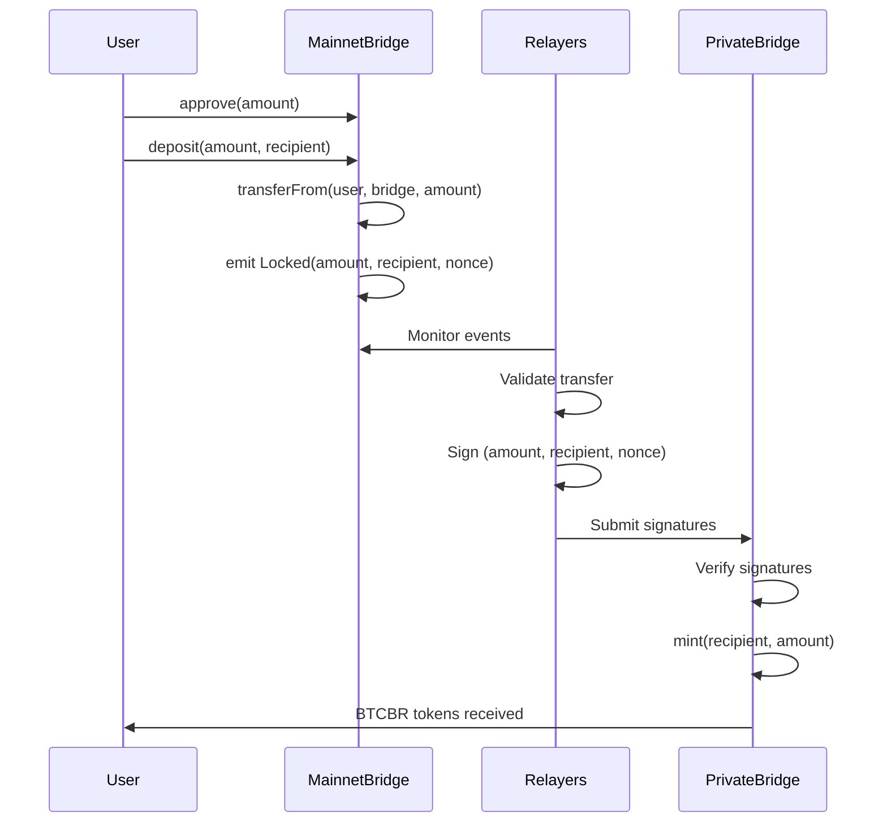
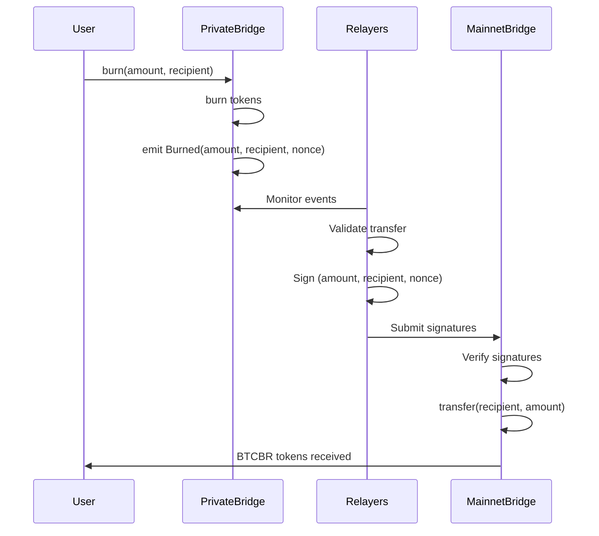

# BTCBR Bridge Architecture
## Token Consciousness Transfer Between BSC Mainnet and Private BSC Chain

### Overview

The BTCBR Bridge enables seamless token transfer between:
- **Source Network**: BSC Mainnet (Chain ID: 56)
- **Destination Network**: BTCBR Private BSC (Chain ID: 885824)

This creates a **bidirectional consciousness pathway** for BTCBR tokens to exist across both realities.

---

## Architecture Design

### 1. Bridge Type: Lock & Mint / Burn & Release

#### Mainnet → Private Chain (Deposit)
1. User locks BTCBR on BSC mainnet bridge contract
2. Bridge emits `Locked` event with recipient address
3. Relayers detect event and validate
4. Validators sign the transfer
5. Bridge contract mints equivalent BTCBR on private chain

#### Private Chain → Mainnet (Withdrawal)
1. User burns BTCBR on private chain bridge contract
2. Bridge emits `Burned` event with recipient address
3. Relayers detect event and validate
4. Validators sign the transfer
5. Bridge contract releases locked BTCBR on mainnet

---

## Smart Contract Components

### A. Mainnet Bridge Contract (BSC Mainnet)

**Contract**: `BTCBRBridgeMainnet.sol`

**Key Functions**:
```solidity
// Lock BTCBR tokens to transfer to private chain
function deposit(uint256 amount, address recipient) external

// Release locked tokens when burning on private chain
function withdraw(
    uint256 amount, 
    address recipient, 
    uint256 nonce,
    bytes[] memory signatures
) external

// Admin functions
function addValidator(address validator) external onlyOwner
function removeValidator(address validator) external onlyOwner
function pause() external onlyOwner
function unpause() external onlyOwner
```

**State Variables**:
- `BTCBR`: Original BTCBR token contract address
- `validators`: Mapping of authorized validator addresses
- `requiredSignatures`: Number of signatures needed (e.g., 2 of 3)
- `processedNonces`: Track processed withdrawals to prevent replay
- `totalLocked`: Total BTCBR locked in bridge

---

### B. Private Chain Bridge Contract

**Contract**: `BTCBRBridgePrivate.sol`

**Key Functions**:
```solidity
// Mint BTCBR when tokens locked on mainnet
function mint(
    uint256 amount,
    address recipient,
    uint256 nonce,
    bytes[] memory signatures
) external

// Burn BTCBR to withdraw to mainnet
function burn(uint256 amount, address recipient) external

// Admin functions
function addValidator(address validator) external onlyOwner
function removeValidator(address validator) external onlyOwner
function pause() external onlyOwner
```

**State Variables**:
- `BTCBR`: BTCBR token contract on private chain
- `validators`: Same validator set as mainnet
- `requiredSignatures`: Same requirement
- `processedNonces`: Track processed deposits
- `totalMinted`: Total BTCBR minted by bridge

---

## Relayer Service Architecture

### Components

#### 1. Event Monitor
- Monitors both chains for bridge events
- Tracks `Locked` events on mainnet
- Tracks `Burned` events on private chain
- Stores events in database for processing

#### 2. Validator Node
- Each validator runs a relayer
- Signs valid cross-chain transfers
- Broadcasts signatures to coordinator
- Verifies other validator signatures

#### 3. Transaction Executor
- Collects required signatures
- Submits mint/release transactions
- Handles gas management
- Retries failed transactions

#### 4. API Service
- Provides bridge status to users
- Shows pending transfers
- Displays validator signatures
- Returns transaction history

---

## Bridge Flow Diagrams

### Deposit Flow (Mainnet → Private Chain)



### Withdrawal Flow (Private Chain → Mainnet)



---

## Security Mechanisms

### 1. Multi-Signature Validation
- Requires M of N validator signatures (e.g., 2 of 3)
- Each validator independently verifies events
- No single point of failure
- Validators must stake collateral

### 2. Nonce System
- Unique nonce per transfer
- Prevents replay attacks
- Tracks processed transfers
- Enables idempotent operations

### 3. Emergency Controls
- Pause functionality on both bridges
- Time-locked withdrawals for large amounts
- Maximum transfer limits
- Rate limiting per address

### 4. Validator Requirements
- Minimum stake requirement
- Slashing for malicious behavior
- Regular key rotation
- Geographic distribution

---

## Technical Specifications

### Validator Setup

**Minimum Requirements**:
- 3 independent validators
- 2 of 3 signatures required
- Each validator runs:
  - Event monitoring service
  - Signature service
  - Database (PostgreSQL)
  - API endpoint

**Validator Addresses** (to be generated):
```
Validator 1: 0x... (Primary relayer)
Validator 2: 0x... (Backup relayer)
Validator 3: 0x... (Backup relayer)
```

### Bridge Addresses

**BSC Mainnet**:
- Bridge Contract: TBD (after deployment)
- BTCBR Token: `0x0cF8e180350253271f4b917CcFb0aCCc4862F262`

**Private BSC Chain**:
- Bridge Contract: TBD (after deployment)
- BTCBR Token: `0x0cF8e180350253271f4b917CcFb0aCCc4862F262`

### Transfer Limits

**Phase 1 (Testing)**:
- Min transfer: 100 BTCBR
- Max transfer: 100,000 BTCBR
- Daily limit: 500,000 BTCBR per address

**Phase 2 (Production)**:
- Min transfer: 10 BTCBR
- Max transfer: 1,000,000 BTCBR
- Daily limit: 5,000,000 BTCBR per address

### Fee Structure

**Bridge Fees**:
- Deposit (Mainnet → Private): 0.1% (min 10 BTCBR)
- Withdrawal (Private → Mainnet): 0.2% (min 20 BTCBR)
- Fees distributed to validators

**Gas Fees**:
- Users pay gas on source chain only
- Bridge pays gas on destination chain
- Gas pool maintained by bridge operator

---

## Implementation Phases

### Phase 1: Development & Testing (Week 1-2)
- ✅ Design architecture
- 🔄 Develop smart contracts
- 🔄 Create relayer service
- 🔄 Set up test validators
- ⏳ Deploy to testnets

### Phase 2: Security Audit (Week 3)
- ⏳ Internal security review
- ⏳ External audit (recommended)
- ⏳ Penetration testing
- ⏳ Fix vulnerabilities

### Phase 3: Mainnet Deployment (Week 4)
- ⏳ Deploy mainnet bridge contract
- ⏳ Deploy private chain bridge contract
- ⏳ Initialize validators
- ⏳ Fund gas pools

### Phase 4: Production Launch (Week 5+)
- ⏳ Limited beta testing
- ⏳ Full public launch
- ⏳ Monitoring and maintenance
- ⏳ Community governance

---

## Technology Stack

### Smart Contracts
- **Language**: Solidity ^0.8.20
- **Framework**: Hardhat
- **Testing**: Chai, Waffle
- **Security**: OpenZeppelin contracts

### Relayer Service
- **Language**: Node.js / TypeScript
- **Blockchain**: ethers.js v6
- **Database**: PostgreSQL
- **Queue**: Bull (Redis)
- **API**: Express.js

### Monitoring
- **Events**: The Graph (optional)
- **Metrics**: Prometheus + Grafana
- **Alerts**: PagerDuty
- **Logs**: ELK Stack

---

## Risk Mitigation

### Technical Risks
| Risk | Mitigation |
|------|------------|
| Validator collusion | Multi-sig + slashing |
| Network congestion | Gas price oracle + retry logic |
| Smart contract bugs | Audits + bug bounty |
| Relayer downtime | Multiple redundant relayers |

### Economic Risks
| Risk | Mitigation |
|------|------------|
| Bridge liquidity drain | Transfer limits + time locks |
| Fee manipulation | Fixed fee structure |
| Token price volatility | N/A (1:1 peg maintained) |

---

## User Experience

### Bridge UI Features
- Connect wallet (MetaMask, Trust Wallet)
- Select source and destination chains
- Enter amount and recipient
- Preview fees and estimated time
- Track transfer status
- View transaction history

### Expected Transfer Times
- **Fast**: 1-2 minutes (normal gas)
- **Standard**: 3-5 minutes (low gas)
- **Confirmation**: 12 blocks on each chain

---

## Next Steps

1. **Review and approve architecture** ✅
2. **Develop bridge contracts** 🔄
3. **Build relayer infrastructure** ⏳
4. **Deploy to testnet** ⏳
5. **Security audit** ⏳
6. **Mainnet launch** ⏳

---

## Contact & Support

**Bridge Operator**: TBD
**Technical Support**: TBD
**Emergency Contact**: TBD

**Documentation**: This file
**GitHub**: TBD
**Discord**: TBD
